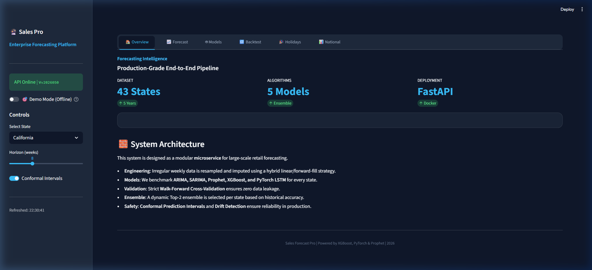
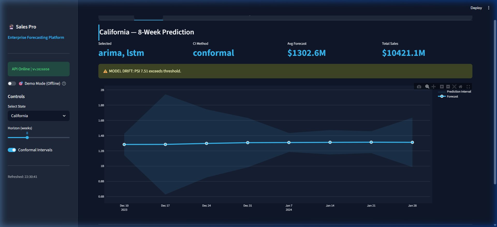
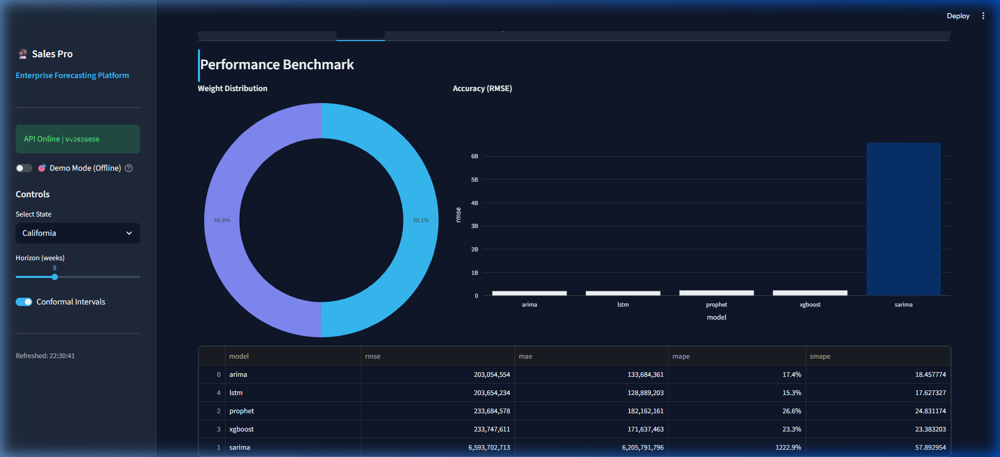
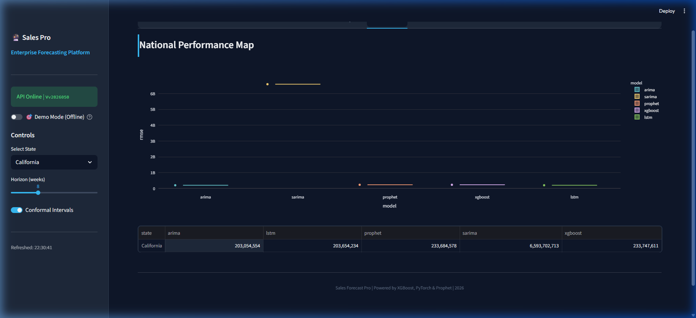

# 🔮 Sales Forecast Pro: Weekly Time-Series Intelligence

**Sales Forecast Pro** is a production-grade forecasting pipeline that transforms irregular retail data into high-precision, 8-week per-state sales predictions. Designed for the beverage industry, the system benchmarks 5 model families, monitors drift, and serves insights via an interactive dashboard.




---

## 🚀 Key Features

### 🧠 Model Intelligence & Selection
- **5-Model Ensemble**: Benchmarks **ARIMA, SARIMA, Prophet, XGBoost, and PyTorch LSTM** for every state.
- **Dynamic Weighting**: Automatically selects and weights the top 2 performing models per state based on historical residuals.
- **Fourier Seasonality**: Captures smooth mathematical waves for quarterly and yearly cycles.

### 🛡️ Production Infrastructure
- **Leakage-Safe Validation**: Implements a strict **Walk-Forward Cross-Validation** strategy.
- **Split-Conformal Prediction**: Provides finite-sample-valid 90% confidence intervals.
- **Drift Detection**: Integrated **Population Stability Index (PSI)** and **KS-tests** to monitor data health.

### 📊 Professional Interface
- **Midnight Blue Dashboard**: A high-contrast Streamlit UI designed for enterprise reporting.
- **Drift Badges**: Real-time visibility into model stability and data distribution shifts.
- **PDF Reporting**: Generate automated multi-page executive summaries for any state.




---

## 🛠️ Tech Stack

- **Backend**: FastAPI (Python)
- **Frontend**: Streamlit + Plotly
- **Machine Learning**: Scikit-Learn, XGBoost, Prophet, Statsmodels
- **Deep Learning**: PyTorch (LSTM)
- **Containerization**: Docker + Docker Compose

---

## 📁 Project Structure

```text
microg/
├── dashboard/              # Streamlit UI + Custom CSS
├── data/raw/               # Source dataset (Sales.xlsx)
├── src/sales_forecast/
│   ├── api/                # FastAPI service, schemas, and PDF reports
│   ├── models/             # The 5 core model implementations + Ensemble logic
│   ├── training/           # End-to-end pipeline (Optuna + CV)
│   └── utils/              # Registry, Drift, Logging, and Conformal logic
├── artifacts/              # Versioned Model Registry (gitignored)
├── config.yaml             # Single source of truth for all hyperparameters
└── pyproject.toml          # Dependency management
```

---

## 🚦 Quick Start

### 1. Installation
```bash
# Clone the repository
git clone https://github.com/praveen0006/MicroG.git
cd MicroG

# Install dependencies
pip install -e .
```

### 2. Training (Example: California)
```bash
python -m sales_forecast.training.cli --states California
```

### 3. Launching the System
```bash
# Terminal 1: Start the API
sales-forecast-api --port 8000

# Terminal 2: Start the Dashboard
streamlit run dashboard/streamlit_app.py
```

---

## ⚖️ License
Distributed under the MIT License. See `LICENSE` for more information.
